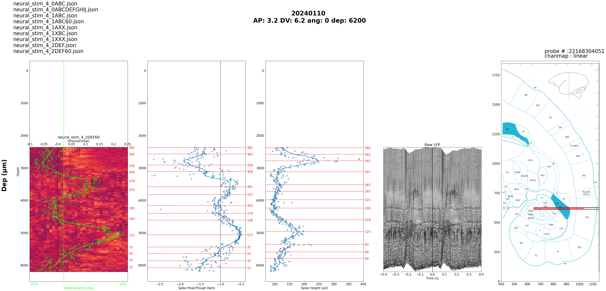

# data_analysis_tools_mkTurk

Functions for processing and analyzing mkTurk datafiles and electrophysiology data.

> A **session** is a behavioral/neural recording for a particular date and subject. Each session can contain multiple mkTurk behavior data files and multiple electrophysiology data files.

---

## Key Outputs

### `data_dict_XX`

`get_data_dict_from_mkturk.ipynb` aligns neural data to behavior data by searching for filecodes in the recorded triggers and matching them with behavior datafile names. The result is a pickled dictionary indexed by trial/RSVP instance within a session.

Each entry holds a `stim_info` dataframe where the first column lists all elements within the scene:

```python
data_dict[<i>]['stim_info']
```


### `stim_info_sess`

Also produced by `get_data_dict_from_mkturk.ipynb`. Groups all presentations of a single stimulus within a session. Keys correspond to `data_dict[<i>]['short_stim_info']`.

| Field | Description |
| --- | --- |
| `stim_ind` | Index of the stimulus within a datafile |
| `t_on_mk` | Stimulus onset time from mkTurk (software timing) |
| `t_on` | Stimulus onset time adjusted by photodiode (hardware timing) |
| `dur` | Stimulus duration |
| `iti_dur` | Grey screen duration after the stimulus |
| `present_bool` | Whether the stimulus was on screen (false if monkey aborted fixation early) |
| `rsvp_num` | Position within an RSVP sequence (equals `trial_num` for non-RSVP tasks) |
| `trial_num` | Trial number |
| `reward_bool` | Whether the trial was rewarded |
| `scenefile` | Which scenefile the stimulus belongs to (same stimulus can appear in multiple scenefiles) |

---

## Pipeline: Multiunit Data to PSTH per Channel

After multiunit and trigger data are ready:

| Step | Action |
| --- | --- |
| 1 | Run `get_data_dict_from_mkturk.ipynb` |
| 2 | Upload `analyze_bystim.py` and `analyze_bystim.sh` to the GPU cluster |
| 3 | Edit `analyze_bystim.sh` with the appropriate date and monkey |
| 4 | Run `analyze_bystim.sh` |

---

## Slurm: Processing Multiple Sessions and Channels

### 1. Prepare bash files

Create multiple `analyze_bystim_parallel.sh` files for different sessions and upload them to the GPU cluster.

### 2. Create `all_tasks.txt`

Each line specifies a session and channel pair:

```bash
for sess in bashfiles/analyze_bystim_West_*; do
    for chan in {0..383}; do
        echo "$sess $chan" >> all_tasks.txt
    done
done
```

The resulting file looks like:

```
bashfiles/analyze_bystim_West_20230830 0
bashfiles/analyze_bystim_West_20230830 1
bashfiles/analyze_bystim_West_20230830 2
...
bashfiles/analyze_bystim_West_20230830 383
bashfiles/analyze_bystim_West_20230911 0
...
```

### 3. Submit with `master_process.sbatch`

Runs up to 1000 jobs (the Axon cluster maximum). In an unconstrained environment, set the job count to the total number of lines in `all_tasks.txt`. Each job processes the appropriate lines from that file.

---

## `waveform_characterization_bydepth.py`

Computes and plots waveform features as a function of recording depth, aligned to trial-averaged LFP and z-scored PSTH across all Neuropixels channels. Inspired by [Zhang et al. (2024) eLife](https://doi.org/10.7554/eLife.97290.2).

### Usage

```bash
python waveform_characterization_bydepth.py <n_chan> <monkey> <date>
```

| Argument | Description |
| --- | --- |
| `n_chan` | Total number of AP channels recorded (int) |
| `monkey` | Subject identifier, e.g. `'Pogo'` |
| `date` | Recording date string matching the data directory name |

### Prerequisites

The following files must already exist in the session's save directory before running:

| File | Source |
| --- | --- |
| `stim_info_sess` | `get_data_dict_from_mkturk.ipynb` |
| `LFP/lfp_mat.npz` | LFP preprocessing pipeline |
| `wf_features.npz` | Waveform feature extraction pipeline |
| `psth_scenefile_meta`, `psth_*` | `analyze_bystim.py` |
| `brain_boundary.npy` | Optional — defaults to channel 383 if absent |

### Output figure

Saves a 5-panel figure (`waveform_features.png`) to the session plot directory and to the shared `laminar_characterization` directory.

| Panel | Content |
| --- | --- |
| 1 | z-scored PSTH heatmap vs depth for the highest-response scenefile |
| 2 | Mean spike peak/trough ratio vs depth |
| 3 | Mean spike height (µV) vs depth |
| 4 | Trial-averaged, CAR-corrected raw LFP traces vs depth |
| 5 | Paxinos marmoset atlas slice with probe placement overlay |



---

## `behavior_processing.py`

Contains functions to sort mkTurk datafiles by tasks, and create trial-based arrays.
